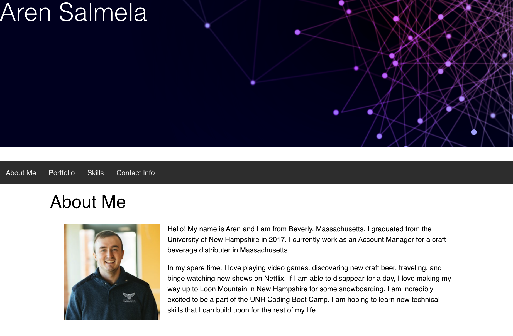

# User Directory

## This app is deployed on Heroku https://ads-react-portfolio.herokuapp.com/

## License

## Project Description

Refactored by current responsive portfolio in react. I seperated sections of my previous portfolio into components to use with react. Bootstrap is also utlized for styling purposes. 

## Github Username

https://github.com/arensalmela

## Github Repository

https://github.com/arensalmela/React-Portfolio

## Screenshot

